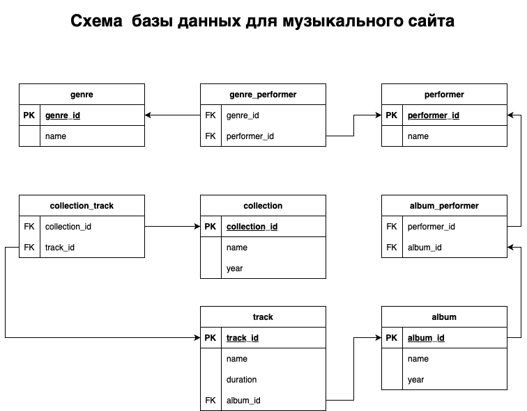

# Музыкальный сервис

Сущности:
- genre - жанры. У жанра есть название. Для каждого жанра можно получить список исполнителей, которые выступают в соответствующем жанре;
- performer - исполнители. У исполнителя есть имя (псевдоним) и жанр, в котором он исполняет. Для каждого исполнителя можно получить список его альбомов;
- album - альбомы. У альбома есть название, год выпуска и его исполнители. Для каждого альбома можно получить список треков, которые в него входят;
- track - треки. У трека есть название, длительность и альбом, которому этот трек принадлежит.
